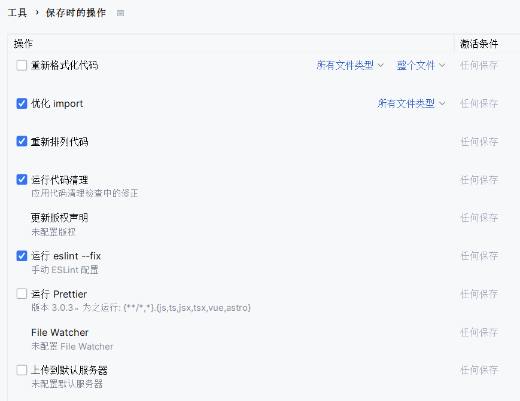

# micro-frontend-demo-main-app

基于`qiankun`框架的微前端项目
- [主应用配置](https://github.com/SpinaciaKeh/micro-frontend-demo-main-app)（**本项目**）:  `vue3` + `vite` + `ts`
- [微应用1配置](https://github.com/SpinaciaKeh/micro-frontend-demo-micro-app-1):  `vue3` + `vite` + `ts`
- [微应用2配置](https://github.com/SpinaciaKeh/micro-frontend-demo-micro-app-2):  `vue2` + `webpack5`

---

### 技术栈

- 脚手架工具 `vite`
- 前端框架 `vue3`
- 状态管理器 `pinia`
- 开发语言 `typescript`
- UI库 `element-plus`
- css样式 `sass`
- 代码检查 `eslint`
- 代码格式化 `prettier`

### 项目目录

- `api` 接口
- `asserts` 静态资源
- `components` 公共组件
- `config` 全局配置文件
- `router` 路由
- `store` 全局状态管理器
- `styles` 样式文件
- `types` 类型声明
- `utils` 工具库
- `views` 页面


---

配置`eslint`和`prettier`后，在`webstorm`中设置↓


---

## Import Qiankun

#### 安装依赖
```
pnpm add qiankun
```

#### 创建`/src/config/subapp.js`
具体配置需要和子应用一致
```
export default {
  subApps: [
    {
      name: 'app-vue3-vite',
      entry: '//localhost:5001',
      container: '#sub-container',
      activeRule: '/app/app-vue3-vite',
      props: {}
    },
    ...
  ]
}
```

#### 创建`/src/utils/qiankun.js`
```
import config from '@/config/subapp.js'
import { registerMicroApps } from 'qiankun'

const { subApps } = config

export function registerApps() {
  try {
    registerMicroApps(subApps, {
      beforeLoad: [
        app => {
          console.log('before load', app)
        }
      ],
      beforeMount: [
        app => {
          console.log('before mount', app)
        }
      ],
      afterUnmount: [
        app => {
          console.log('after unmount', app)
        }
      ]
    })
  } catch (err) {
    console.log(err)
  }
}
```

#### 创建`/src/components/SubApp.vue`
```
<template>
  <div id="sub-container" />
</template>

<script lang="ts" setup>
import { start } from 'qiankun'
import { registerApps } from '@/utils/qiankun.js'
import { onMounted } from 'vue'

onMounted(() => {
  console.log('trigger sub container')
  if (!window.qiankunStarted) {
    window.qiankunStarted = true
    registerApps()
    start({
      sandbox: {
        experimentalStyleIsolation: true
      }
    })
  }
})
</script>

<style scoped>
#sub-container {
  height: 100%;
}
</style>
```

#### 在`/src/vite-env.d.ts`中声明
```
/// <reference types="vite/client" />

declare module '@/utils/qiankun.js'

declare interface Window {
  qiankunStarted: boolean
}
```

#### 配置路由
```
{
  path: 'app/app-vue3-vite/:pathMatch(.*)*',
  name: 'app-vue3-vite',
  meta: {},
  component: () => import('@/components/SubApp.vue')
},
```

#### 在子应用入口按钮通过`vue-router`实现跳转
```
<router-link to="/app/app-vue3-vite/#/">App1</router-link>
```
